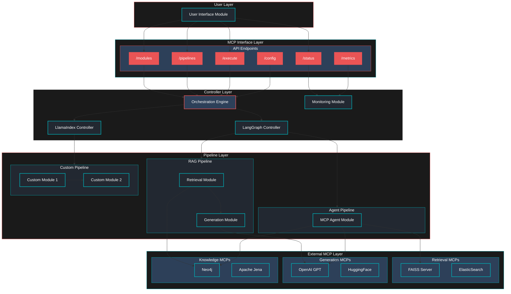

# mcp-rag-control
Map-Based Control for Agentic RAG Systems

## Architecture

```mermaid%%{init: {'theme': 'dark'}}%%
graph TB
    %% Define layers using subgraphs
    subgraph Layer1[User Layer]
        UI[User Interface Module]
    end

    subgraph Layer2[MCP Interface Layer]
        subgraph API_Endpoints[API Endpoints]
            Modules["/modules"]
            Pipelines["/pipelines"]
            Config["/config"]
            Status["/status"]
            Metrics["/metrics"]
            Execute["/execute"]
        end
    end

    subgraph Layer3[Controller Layer]
        OE[Orchestration Engine]
        LG[LangGraph Controller]
        LI[LlamaIndex Controller]
        MM[Monitoring Module]
    end

    subgraph Layer4[Pipeline Layer]
        subgraph RAG_Pipeline[RAG Pipeline]
            RM[Retrieval Module]
            GM[Generation Module]
        end
        
        subgraph Agent_Pipeline[Agent Pipeline]
            AM[MCP Agent Module]
        end
        
        subgraph Custom_Pipeline[Custom Pipeline]
            CM[Custom Module 1]
            CM2[Custom Module 2]
        end
    end

    subgraph Layer5[External MCP Layer]
        subgraph Retrieval_MCPs[Retrieval MCPs]
            FAISS[FAISS Server]
            ES[ElasticSearch]
        end
        
        subgraph Generation_MCPs[Generation MCPs]
            GPT[OpenAI GPT]
            HF[HuggingFace]
        end
        
        subgraph Knowledge_MCPs[Knowledge MCPs]
            NEO[Neo4j]
            JENA[Apache Jena]
        end
    end

    %% User Layer Interactions
    UI --> Modules
    UI --> Pipelines
    UI --> Status
    UI --> Execute

    %% API Endpoint Interactions
    Modules --> OE
    Pipelines --> OE
    Execute --> OE
    Status --> MM
    Metrics --> MM
    Config --> OE

    %% Controller Layer Interactions
    OE --> LG
    OE --> LI
    LG --> RAG_Pipeline
    LG --> Agent_Pipeline
    LI --> Custom_Pipeline

    %% Pipeline Control
    RM --> GM
    CM --> CM2
    
    %% External MCP Interactions
    RM --> NEO
    GM --> GPT
    AM --> FAISS
    AM --> GPT
    AM --> NEO

    %% Styling
    classDef primary fill:#2D4059,stroke:#EA5455,stroke-width:2px,color:#fff
    classDef secondary fill:#222831,stroke:#00ADB5,stroke-width:2px,color:#fff
    classDef storage fill:#393E46,stroke:#EEEEEE,stroke-width:2px,color:#fff
    classDef mcp fill:#2D4059,stroke:#00ADB5,stroke-width:2px,color:#fff
    classDef endpoint fill:#EA5455,stroke:#2D4059,stroke-width:2px,color:#fff
    
    class OE primary
    class RM,GM,UI,MM,LG,LI,AM,CM,CM2 secondary
    class FAISS,ES,GPT,HF,NEO,JENA mcp
    class Modules,Pipelines,Config,Status,Metrics,Execute endpoint

    %% Layer Styling
    style Layer1 fill:#1A1A1A,stroke:#EA5455,color:#fff
    style Layer2 fill:#1A1A1A,stroke:#00ADB5,color:#fff
    style Layer3 fill:#1A1A1A,stroke:#EEEEEE,color:#fff
    style Layer4 fill:#1A1A1A,stroke:#EA5455,color:#fff
    style Layer5 fill:#1A1A1A,stroke:#00ADB5,color:#fff
    
    %% Subgraph Styling
    style API_Endpoints fill:#2D4059,stroke:#EA5455,color:#fff
    style RAG_Pipeline fill:#222831,stroke:#00ADB5,color:#fff
    style Agent_Pipeline fill:#222831,stroke:#00ADB5,color:#fff
    style Custom_Pipeline fill:#222831,stroke:#00ADB5,color:#fff
    style Retrieval_MCPs fill:#2D4059,stroke:#00ADB5,color:#fff
    style Generation_MCPs fill:#2D4059,stroke:#00ADB5,color:#fff
    style Knowledge_MCPs fill:#2D4059,stroke:#00ADB5,color:#fff
```